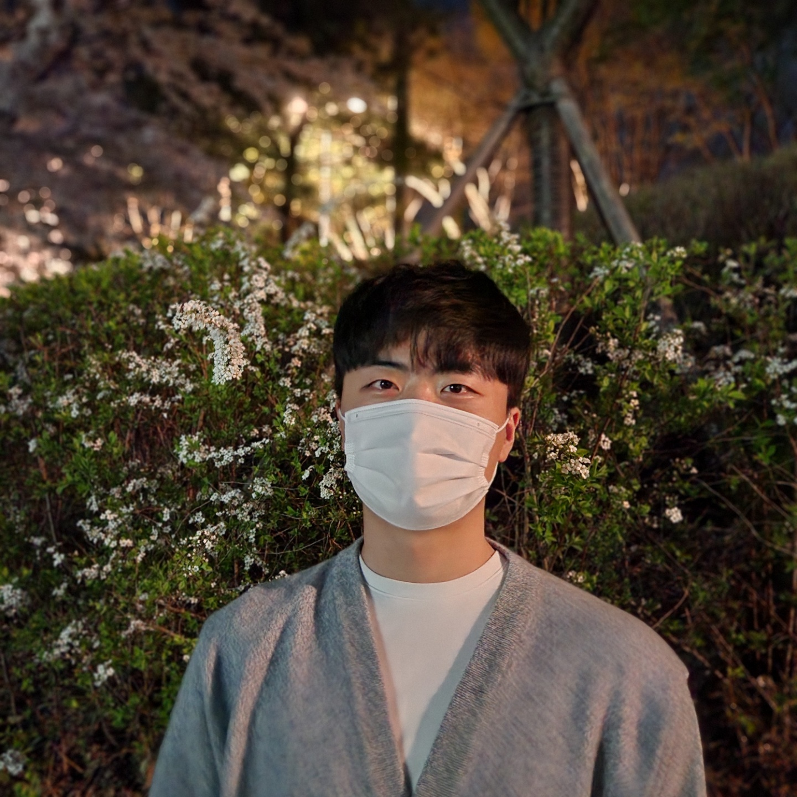
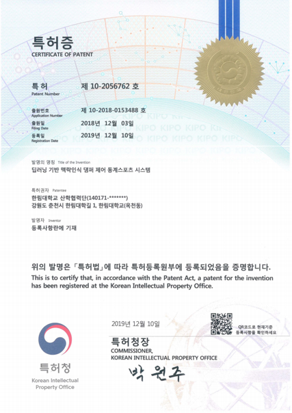
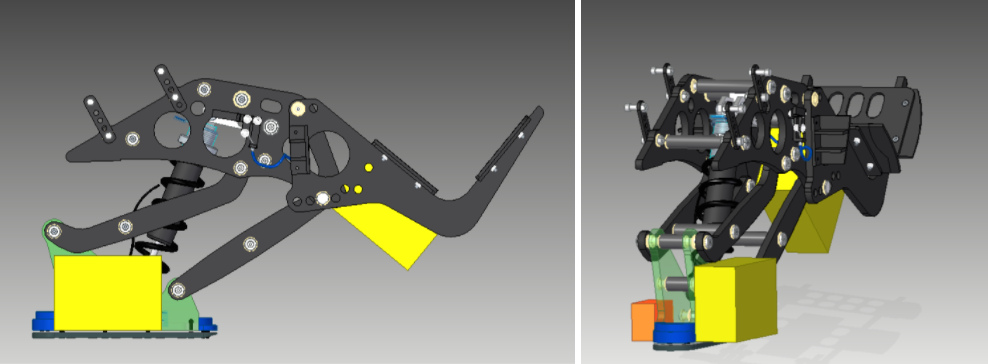
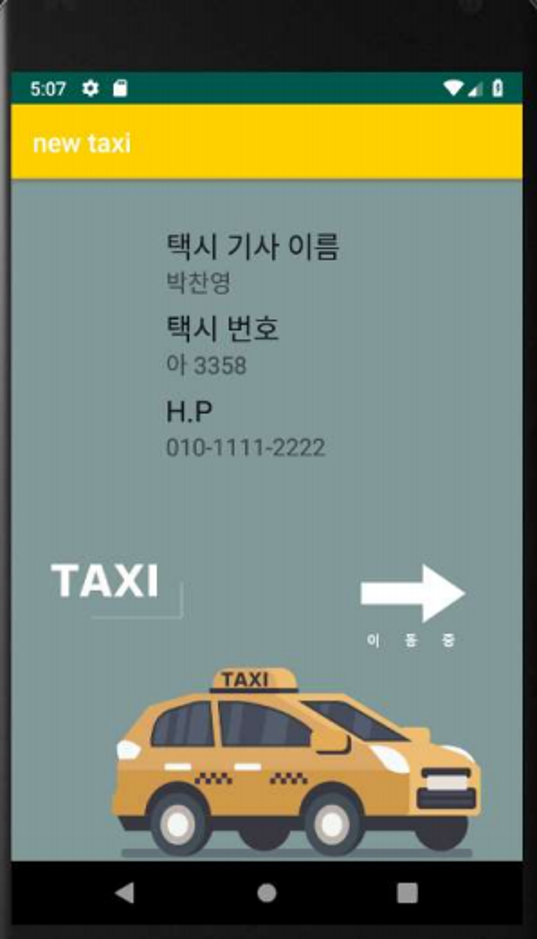
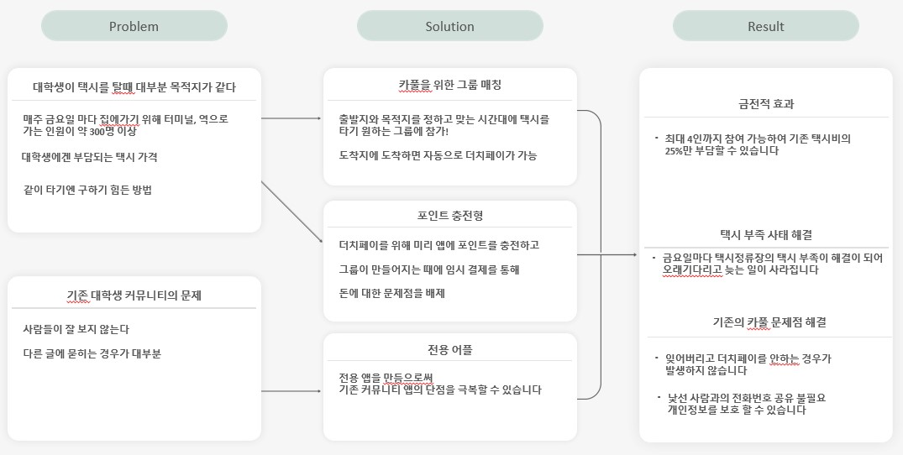
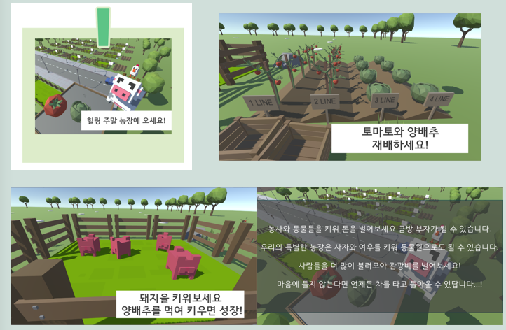
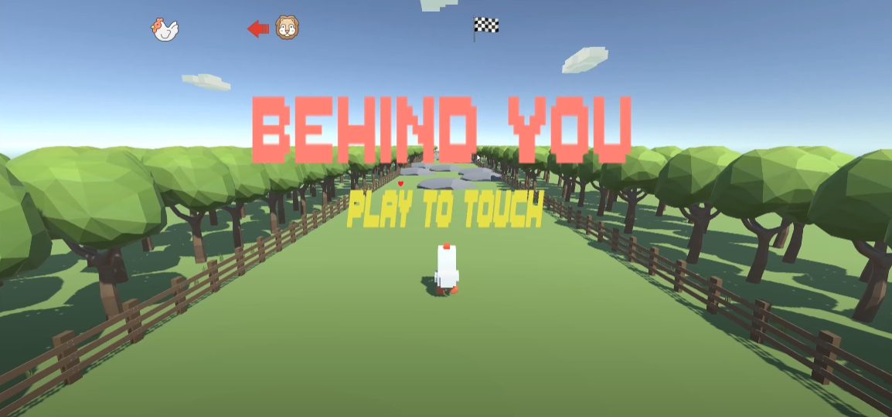

# Developer Book

---



## 이화준 (LEE HWA JUN)

### 👋자기소개

```
안녕하세요! 풀스택 웹 개발자를 꿈꾸는 이화준입니다.

웹개발을 시작한 이유는 사실 처음에 AI나 드론,3D프린터쪽으로 진로를 희망하고 공부를
했으나, 하다보니 공부도 잘 안되고 흥미도 너무 떨어져서 초심때 목표로 했던 웹개발로 
뒤늦게 길을 돌렸습니다.. 하지만 예전에 했던만큼 금방 실력을 올리고 있고, 현재 풀스택으로
인턴에도 합격을 하였습니다! 늦은만큼 앞으로 더 노력해서 반드시 성공하려고 합니다 :)

주력 기술로는 Django와 React입니다. 두 프레임워크를 좋아하는 이유는 시작이 반이라고
프로젝트를 생성하면 베이스는 완벽하게 구현을 해주고 제가 필요한 기능만 넣어주면 금방
구현할 수 있게 도와주는 최고의 도구라고 생각합니다.
```

### ❤️💪🎳취미

```
취미는 헬스와 볼링입니다!
헬스는 거의 2년이 되어가고 있고, 아직 부족하지만 나름 예쁜 Body shape이라고 생각합니다!
처음에는 거북목, 허리 보완, 어깨가 많이 좁다고 생각되어 시작한 운동인데 점점 욕심이 심해져
현재는 근육량 42kg를 목표로 하고 있습니다. 이전에 36kg 찍었지만 바쁠 때 많이 줄어서
다시 올리느라 열심히 하고 있습니다.

또 다른 취미로 볼링은 원래 싫어하던 운동이었는데, 친구가 볼링 동아리 회장이어서 따라다니다가
점점 재미를 붙여 이제는 제가 먼저 가자고 할 정도입니다. 최근들어 스핀도 배워서 점수가 많이
올라 갔습니다. 평균은 120정도이고 최고 점수가 170점입니다! 볼링을 좋아하는분들과 서로 내기하며
치는 걸 좋아합니다 
```

### ⚖️개발자 성향 테스트

- MBTI

결과 : INTJ

계획중시, 이성적 논리적 성격

- eDISC

결과 : C(신중성), S(안전성) 유형

IT 실무자 및 분석가에 적합하다고 판정 (만점!)

---

### 🖥️보유스킬

- Python ( + Django, Opencv, Tensorflow )
- Java, C, C# ( Unity )
- Linux
- IoT ( MQTT, RaspberryPi, Arduino )
- 3D Modeling & Printing ( Sketch Up, Fusion 360 )
- HTML, JS, CSS ( React )

---

### 🏫학력

- 주전공 빅데이터학과
- 복수전공 AI로봇융합

---

### 🥼연구활동

- 지능로봇연구실(2017~2021)
- 특허-딥러닝 기반 맥락인식 댐퍼 제어 동계스포츠 제어 시스템

---

### 💡경험

(주)비상교육 AI기획 부서 개발자 2개월 실습

York 대학 글로벌 단기 연수 2주

필리핀 다낭 어학연수 2개월

앱(앱인벤터) 아두이노 개발 강의 보조강사

Asuan Haptics 2018 보조

PyConAPAC 2016 참가

SW summer camp in 

---

### 🥇수상내역

2015 드론톤 아마추어 1위

한림대학교 SW해커톤 우수상

SW전공 교과목 연계 경진대회 1위

---

### 💾수행 프로젝트

<details markdown="3">
<summary>딥러닝 기반 맥락인식 댐퍼 제어 시스템 | 2018~2019</summary>

- 프로젝트 목표 : 장애인 스키 선수를 위한 댐퍼 자동 제어 시스템
- 역할 : 위치, 기울기 센서가 있는 데이터 수집용 기기를 제작하고 스키장에서 직접 운행하며 데이터를 수집, 댐퍼 제어용 기기를 제작하는데 기여하며 케이스 모델링


  
</details>

<details markdown="3">
<summary>SW해커톤 택시 카풀 어플 개발 | 2018.11.13~2018.11.14</summary>

- 프로젝트 목표 : 24시간 내에 개발을 하며 택시비 부담을 줄이기 위해 목적지가 같은 사람을 모아 택시를 같이 탈 수 있게하는 서비스
- 역할 : 카풀 그룹 생성 이벤트 및 기타 백앤드+프론트


  
</details>

<details markdown="3">
<summary>Farmtycoon 게임 개발 - Unity | 2021.03~2021.06</summary>

- 프로젝트 목표 : 힐링을 위한 가상현실 기반 농작 타이쿤 게임
- 역할 : 플레이어 이벤트부터 농작물 이벤트, 모든 에셋 관리 등 전반적인 부분 기여

[](https://www.youtube.com/embed/RFCvK_KgxNU?t=0s)
  
</details>

<details markdown="3">
<summary>Behind You 게임 개발 - Unity | 2021.03~2021.06</summary>

- 프로젝트 목표 : VR기반  생존 런닝 게임
- 역할 : 모든 기능 개인 개발

[](https://www.youtube.com/embed/S2j2F9yD7tk?t=0s)
  
</details>

<details markdown="3">
<summary>코로나 지역별 간편 확인 사이트</summary>

- 프로젝트 목표 : 지역별로 코로나 단계를 확인하고, 지역 뉴스와 확진자를 한 홈페이지에서 전부 확인이 가능한 웹 서버
- 역할 : Django백앤드 기능 및 프론트 일부 담당
[](https://www.youtube.com/embed/VhAoHQ4-FvU?t=0s)
  
</details>

---
[](https://www.youtube.com/embed/VhAoHQ4-FvU?t=0s)

### 📆앞으로의 계획

```
우선 6개월 기간의 인턴을 앞두고 있기 때문에 현재 학기를 잘 마치고 인턴 활동에 맞는 기술을
더 향상시켜 좋은 인재가 되려고 노력할 것입니다.

정보처리기사를 준비 중인데 이번 여름에 있는 3회차에 처음 시도하는데 
좋은 결과가 있었으면 합니다.
```
